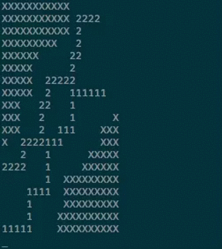

# NIFTY FIFTY PUZZLE

## Prerequisities

The board of the Nifty Fifty Puzzle looks like this

```bash
XXXXXXXXXXX00000000
XXXXXXXXXXX00000000
XXXXXXXXXXX00000000
XXXXXXXXX0000000000
XXXXXX0000000000000
XXXXX00000000000000
XXXXX00000000000000
XXXXX00000000000000
XXX0000000000000000
XXX000000000000000X
XXX0000000000000XXX
X000000000000000XXX
00000000000000XXXXX
0000000000000XXXXXX
0000000000XXXXXXXXX
0000000000XXXXXXXXX
0000000000XXXXXXXXX
000000000XXXXXXXXXX
000000000XXXXXXXXXX
```

A `0` indicates a free place. There are four different puzzle pieces (numbered from 1 to 4)

```bash                       
                              2222              3333              444
           111111             2               333               444
           1               2222               3                 4
           1               2                  3                 4
         111               2                 33                44
       111                22                 3               444
       1                  2                  3             444
       1              22222                333             4
       1              2                 3333            4444
    1111             22                 3               4
    1                2               3333               4
    1                2               3                  4
11111             2222             333               4444
```

The task is to place all four pieces on the board.

## Math

Each puzzle piece can be rotated into four different positions.
It follows

| Puzzle Piece | Path (r: right; u: up)        | Solution | Count  |
|---------  --:|:------------------------------|---------:|-------:|
|            1 | rrrruuurrruuuurrurruuurrrrr   |          |     23 |      
|            1 | uuuurrruuurrrruuruurrruuuuu   |          |     23 |
|            1 | rrrrruuurrurruuuurrruuurrrr   |          |     21 |
|            1 | uuuuurrruuruurrrruuurrruuuu   |        X |     23 |    
|            1 |                               |          |     90 |
|            2 | rrruuuruurrrruuruuurrruurrr   |          |     26 |
|            2 | uuurrrurruuuurrurrruuurruuu   |          |     26 |
|            2 | rrruurrruuuruurrrruuruuurrr   |        X |     28 |
|            2 | uuurruuurrrurruuuurrurrruuu   |          |     26 |
|            2 |                               |          |    106 |
|            3 | rruurrruurrrurruuuruuurrurrr  |          |     19 |
|            3 | uurruuurruuuruurrrurrruuruuu  |          |     21 |
|            3 | rrrurruuuruuurrurrruurrruurr  |          |     21 |
|            3 | uuuruurrrurrruuruuurruuurruu  |        X |     20 |
|            3 |                               |          |     81 |
|            4 | rrruuuurrruurrurruruuurrurr   |        X |     28 |
|            4 | uuurrrruuurruuruururrruuruu   |          |     26 |
|            4 | rrurruuururrurruurrruuuurrr   |          |     28 |
|            4 | uuruurrruruuruurruuurrrruuu   |          |     26 |
|            4 |                               |          |    108 |

In other words, there are 90 different ways for putting the first puzzle piece on the board, 106 for the second, 81 for the third and 108 for the fourth.

| Puzzle Piece  | Combinations |
|--------------:|-------------:|
|             1 |           90 |
|             2 |          106 |
|             3 |           81 |
|             4 |          108 |
|               |          385 |

For all pairs of puzzle pieces we obtain a total of 12548 possibilities.

| Puzzle Pieces | Combinations |
|--------------:|-------------:|
|          1, 2 |         2152 |
|          1, 3 |         1386 |
|          1, 4 |         2473 |
|          2, 3 |         1724 |
|          2, 4 |         2914 |
|          3, 4 |         1899 |
|               |        12548 |

There is only one solution to the game, but 6415 possibilities to place three puzzle pieces on the board.

| Puzzle Pieces | Combinations |
|--------------:|-------------:|
|       1, 2, 3 |          592 |
|       2, 3, 4 |         1824 |
|       3, 4, 1 |         1256 |
|       4, 1, 2 |         2743 |
|               |         6415 |

With those numbers one can say something about the difficulty of the game.

- Among all 12548 possible pairs there are only 6 pairs which contribute to the solution, i.e. if one select a pair randomly, the probability of having the game partially solved is 0.0478%.
- Among all 6415 possible triples there are only 4 triples which contribute to the solution, i.e. if one select a triple randomly, the probability of having the game partially solved is 0.0624%.

**Note:** The above numbers are correct if the puzzle solver places the pieces randomly on the board (equal distribution), which is not true in reality. Of course a good puzzle solver can anticipate which pieces fit better than others. In other words, the probability for a good pair constellation (leaving less blank spaces) of being a partial solution is significantly higher than for a bad pair constellation.

## Solution and Ruby script

The only solution to the problem is

```bash
XXXXXXXXXXX00444030
XXXXXXXXXXX44400030
XXXXXXXXXXX41003330
XXXXXXXXX0041003000
XXXXXX0000441003000
XXXXX00044401333000
XXXXX04441111302222
XXXXX04001000302000
XXX4444001003302000
XXX401111100302200X
XXX4010003333020XXX
X004113333222220XXX
44441030002000XXXXX
0111133002200XXXXXX
0100030002XXXXXXXXX
0100030002XXXXXXXXX
0100032222XXXXXXXXX
010000200XXXXXXXXXX
010222200XXXXXXXXXX
```

For determing the solution one can call the ruby script `nf.rb` by

```bash
./nf.rb
```

It uses a backtracking algorithm to calculate all possible solutions.

Provide custom lambda functions for variations of the output, e.g. in `nf.rb` replace the line

```ruby
NF::Algorithm.new(map, path_groups).call
```

by

```ruby
counter = Hash.new(0)
NF::Algorithm.new(map, path_groups).call(
  found: -> (_, _) {},
  expanded: -> (map, vector) do
    puts map
    counter[vector.count] += 1
  end
)
puts counter
```

to count and print all the partial solutions to the screen.
Here, the backtracking algorithm in action


